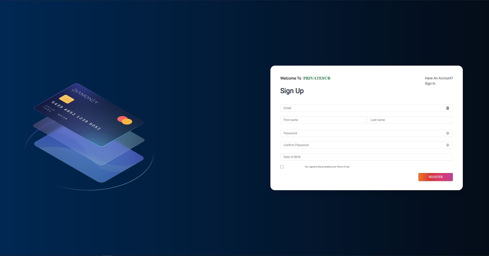
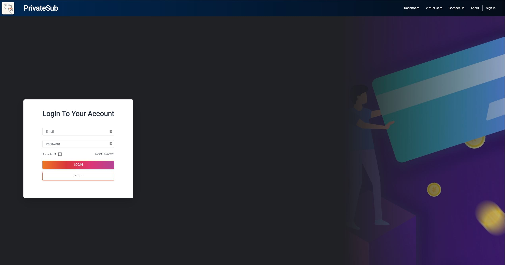
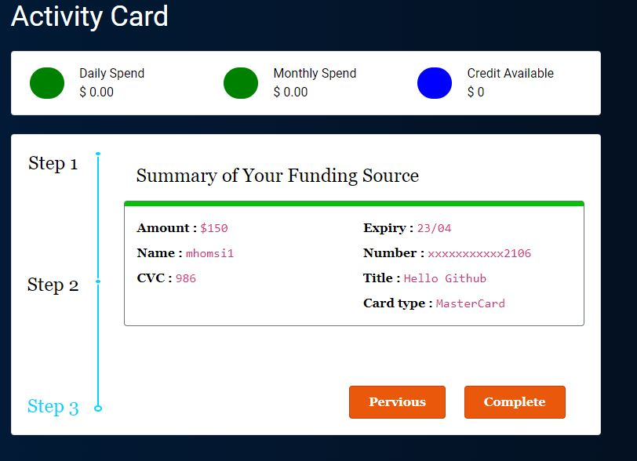
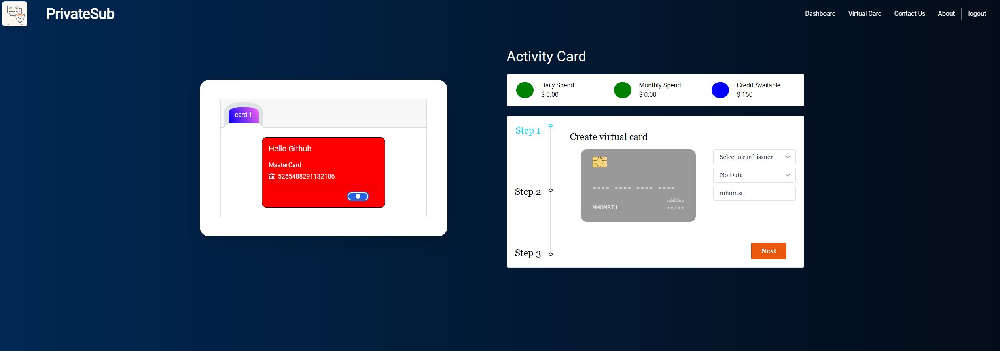
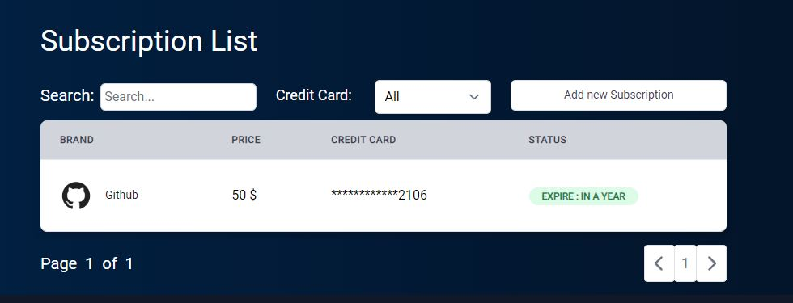

# PrivateSub

ACCESS LINK : [DEMO](https://privatesub-project.web.app/)

## Members

| Name            | Github     | Email                  |
| --------------- | ---------- | ---------------------- |
| James Bilik     | bjam3s     | jbilik@myseneca.ca     |
| Kamyab Rouhifar | karouhifar | karouhifar@myseneca.ca |
| Majd Homsi      | MajdHomsi  | mhomsi1@myseneca.ca    |
| Nenad Ostojic   | nostojic   | nostojic@myseneca.ca   |
| Yuri Yoon       | yulque     | yryoon@myseneca.ca     |

### What Is PrivateSub?

---

As technology has been developed and modernized, it improves the peoples’ demands to have an efficient living. With the evolution of the Internet, all online transactions and subscriptions to social network media are made by real, physical payment cards. However, setting memberships to different e-commerce web services would lead to many issues for individuals, such as poor memory for remembering all listed subscriptions, money loss from card transactions, and security concerns. The current system of most applications cannot cancel auto-pay subscriptions automatically, which has been processed by real credit cards.

Traditional credit cards mostly rely on banking systems with the current use of physical payments cards. Any mistake of using the cards for purchasing ‘purposes can cause time-consuming to put the client through a representative for any solving problems. Although physical cards can be used for online memberships, more issues have been encountered in this case, like the process of re-issuing and filling in the repetitive forms when expired, lost, or stolen. Consequently, Certain businesses will discover the criteria of having physical cards are a less flexible choice and do not always match the scenarios of customer’s needs. By reducing the substantial number of casualties, our objectives need to be productive and convenient to improve customer requirements.

### PrivateSub User Guide
---
Register for PrivateSub [here](https://privatesub-project.web.app/), Create a Username and Password unique to you.



Sign in into your privatesub-project.web.app:



Upong signing in, ensure to input your phone number for 2FA for your saftey prior to logging in.


Once Logged in you will be brought to a front page where you can read all the information needed about PrivateSub. 

Using PrivateSub
---
Start by going into the Virtual Card Tab, you will be brought to a Activity Card Page Where you can start by creating a Virtual Card to use.


#### To create a card do the following: 
1. [Select a card issuer](#select)
2. [Select a Card Number](#inputCardNumber)
3. [Click on Next](#next)
4. [Add a Funding Amount to load into the Virtual Card to be able to use it](#Funding)
5. [Add a special title for your card for better tracking](#title)
6. [Click Next](#Next)


You will then review your added information and can Complete when satisfied to create the card:



Once the card is created, you can go back to the virtual card tab and view your created card and enable it, in addition you will get to view *Daily Spend*, *Monthly Spend* & *Credit Available*



Adding a Subscription
---
### To add a new subscription using your newly created card do the following: 
1. [Go to the Dashboard tab](#dashboard)
2. [Click on add new subscription](#addnew)
3. [Search for a brand](#brand)
4. [Select your Credit Card](#select)
5. [Input desired Monthly amount to spend](#monthly)
6. [Click on Add](#add)

You should then see your Subscription added to your list of subscriptions under subscription list



Additionally, you can edit the monthly amount or delete your saved subscription by clicking on it from the list, here you will also know when the next payment will be taken off your account. 


### Installation Manual
---
- need to clone project from github repo

```bash
git clone https://github.com/PrivateSub-project/PrivateSub.git
```

- redirect to react client application 
```bash
.\PrivateSub\client\private-sub
```
- make sure the node package.json is located in folder


- first need to install node modules dependencies
```bash
npm install 
```

-to start application with port 8080 :

```bash
npm start
```

- install the Firebase CLI via npm in system environment

```bash
npm install -g firebase-tools
```

- log in and test the Firebase CLI using your Google account

```bash
firebase login
```

- test that the CLI is properly installed and accessing your account by listing your Firebase projects

```bash
firebase projects:list
```
- It will show  privatesub-project (current) as project ID


---

### Deploy and build Application

- build react project before implementation of firebase application deployment 

```bash
npm run build
```

```bash
firebase deploy
```

### Result


